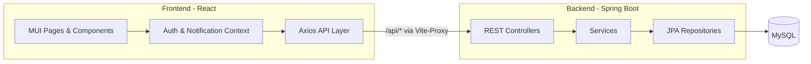

# Study Manager

**Study Manager** ist eine Full-Stack-Plattform zur Erfassung und Verwaltung von Lernzeiten. Studierende setzen Lernziele, planen Sitzungen, nutzen einen Live-Timer, tragen Offline-Lernzeit nach und verfolgen ihren Fortschritt. Administratoren verwalten Benutzer, Rollen, Ziele, Einstellungen, Anmeldeverläufe und ausstehende Admin-Registrierungen.

Dieses Repository enthält das **React-Frontend**. Die REST-API liegt im benachbarten Verzeichnis [`backend`](../backend).

> Englische Version: [`README.md`](README.md)

---

## Inhaltsverzeichnis

- [Funktionen](#funktionen)
- [Technologie-Stack](#technologie-stack)
- [Architektur](#architektur)
- [Voraussetzungen](#voraussetzungen)
- [Erste Schritte](#erste-schritte)
- [Konfiguration](#konfiguration)
- [Standardkonten](#standardkonten)
- [Verfügbare Skripte](#verfügbare-skripte)
- [Anwendungsrouten](#anwendungsrouten)
- [Projektstruktur](#projektstruktur)
- [API-Dokumentation](#api-dokumentation)
- [Authentifizierung](#authentifizierung)
- [Fehlerbehebung](#fehlerbehebung)
- [Lizenz](#lizenz)

---

## Funktionen

### Studierenden-Anwendung

| Modul | Beschreibung |
|-------|--------------|
| **Dashboard** | Übersicht über Ziele, letzte Sitzungen, anstehende Pläne und intelligente Erinnerungen |
| **Goals (Ziele)** | 6-Monats-Lernziele mit Zielstunden, Status und maximal 5 Zwischenzielen (Meilensteinen) pro Ziel |
| **6-Month Plan** | Langfristiger Kalender (Lernen + Pläne + Meilensteine), Ziel-Filter und Planliste (gemeinsam mit Planning) |
| **Monthly Plan** | Monatskalender mit geplanten Sitzungen, Lernaktivität und terminierten Meilensteinen |
| **Planning** | Geplante Lernsitzungen erstellen, bearbeiten, abschließen und löschen (gleiche Daten wie 6-Monats-/Monatsansicht) |
| **Study Timer** | Live-Timer mit Heartbeat-Wiederherstellung; Start auch aus einem Plan |
| **Study History** | Lernzeit anzeigen, bearbeiten, löschen und manuell nachtragen |
| **Progress** | Diagramme und Übersichtskarten (Lernzeit, Ziele, **Meilensteine**, Wochen-/Monatsstatistik) |
| **Notifications** | In-App-Erinnerungen für Pläne, Ziele und Inaktivität; optionale Browser-Benachrichtigungen |
| **Login Gap Alert** | Snackbar bei Rückkehr nach längerer Abwesenheit |

#### Progress — Karte „Meilensteine“

Unter `/progress` zeigt die Karte **Milestones / Meilensteine** die Anzahlen für **aktive Ziele**:

| Kennzahl | Bedeutung |
|----------|-----------|
| Total milestones / Meilensteine insgesamt | Alle Zwischenziele aktiver Ziele |
| Completed milestones / Abgeschlossen | Als erledigt markiert |
| Incomplete milestones / Offen | Noch nicht erledigt |

#### Datenfluss Planung

Pläne aus **Planning** (`/planning`) werden über `/api/plan-sessions` gespeichert und erscheinen in:

- **6-Month Plan** (Kalender + Registerkarte Plans)
- **Monthly Plan** (Kalenderzellen)

Meilensteine mit Fälligkeitsdatum erscheinen als orangefarbene Trophäen-Markierung im Kalender (Monats- und 6-Monats-Plan).

### Admin-Panel

| Modul | Beschreibung |
|-------|--------------|
| **Dashboard** | Plattformstatistiken: Benutzer, Rollen, Ziele, Statusübersicht |
| **Users** | Benutzer auflisten, filtern, aktivieren/deaktivieren, Rollen zuweisen, löschen |
| **Roles** | Rollen erstellen und löschen (Systemrollen sind geschützt) |
| **User Goals** | Admin-Ansicht aller Benutzerziele mit Suche und Paginierung |
| **Settings** | App-Einstellungen (z. B. max. Sitzungsdauer) |
| **Login History** | Anmeldezeitpunkte anzeigen, bearbeiten und löschen |
| **Admin Approvals** | Admin-Registrierungsanträge genehmigen oder ablehnen |

### Authentifizierung & Registrierung

- JWT Access-Token + Refresh-Token
- Studierenden-Registrierung mit sofortigem Zugang
- Admin-Kandidaten-Registrierung mit Freigabe-Workflow (`PENDING` → `APPROVED` / `REJECTED`)
- Rollenbasiertes Routing: Admins → `/admin`, Studierende → `/`

---

## Technologie-Stack

### Frontend (dieses Repository)

| Ebene | Technologie |
|-------|-------------|
| Framework | React 19 |
| Build-Tool | Vite 8 |
| UI | Material UI (MUI) 9 |
| Routing | React Router 7 |
| HTTP-Client | Axios |
| Diagramme | Recharts |
| Datumsverarbeitung | Day.js |

### Backend ([`../backend`](../backend))

| Ebene | Technologie |
|-------|-------------|
| Laufzeit | Java 21 |
| Framework | Spring Boot 4.1 |
| Sicherheit | Spring Security + JWT |
| Persistenz | Spring Data JPA / Hibernate |
| Datenbank | MySQL 8 |
| API-Dokumentation | springdoc-openapi (Swagger UI) |
| Build | Maven |

---

## Architektur



Während der Entwicklung leitet Vite `/api`-Anfragen an `http://localhost:8080` weiter und vermeidet so CORS-Probleme auf dem Client.

---

## Voraussetzungen

| Anforderung | Version |
|-------------|---------|
| **Node.js** | 18+ empfohlen |
| **npm** | 9+ |
| **Java JDK** | 21 |
| **MySQL** | 8.x |
| **Maven** | 3.x (oder Backend-`mvnw`-Wrapper) |

---

## Erste Schritte

### 1. Datenbank anlegen

```sql
CREATE DATABASE study_manager_db
  CHARACTER SET utf8mb4
  COLLATE utf8mb4_unicode_ci;
```

### 2. Backend konfigurieren

Datei `../backend/src/main/resources/application.properties` bearbeiten:

```properties
spring.datasource.url=jdbc:mysql://localhost:3306/study_manager_db?zeroDateTimeBehavior=CONVERT_TO_NULL&serverTimezone=Europe/Berlin
spring.datasource.username=root
spring.datasource.password=IHR_PASSWORT

jwt.secret=IHR_LANGER_SICHERER_GEHEIMSCHLUESSEL
jwt.expiration=86400000
```

> **Hinweis:** Echte Zugangsdaten oder Produktions-Geheimnisse niemals in die Versionskontrolle committen.

### 3. Backend starten

```bash
cd ../backend
./mvnw spring-boot:run        # Linux / macOS
.\mvnw.cmd spring-boot:run    # Windows
```

API-Basis-URL:

```
http://localhost:8080
```

Beim ersten Start legt `DataInitializer` Standardrollen und Testbenutzer an, sofern diese noch nicht existieren.

### 4. Frontend-Abhängigkeiten installieren

```bash
cd frontend
npm install
```

### 5. Frontend starten

```bash
npm run dev
```

Im Browser öffnen:

```
http://localhost:5173
```

---

## Konfiguration

### Frontend-Proxy

`vite.config.js`:

```js
server: {
  proxy: {
    '/api': {
      target: 'http://localhost:8080',
      changeOrigin: true,
    },
  },
},
```

Für die lokale Entwicklung ist keine `.env`-Datei nötig, wenn beide Dienste auf den Standardports laufen.

### Auth-Speicherung

Angemeldeter Benutzer und Tokens werden in `localStorage` unter `lm_auth_user` gespeichert.

---

## Standardkonten

Werden beim Backend-Start automatisch angelegt, falls sie fehlen:

| Rolle | E-Mail | Passwort |
|-------|--------|----------|
| Admin | `admin@example.com` | `admin` |
| Admin | `erkan@erkan.com` | `12345` |
| Student | `student1@example.com` | `student1` |

Admins werden nach dem Login zu `/admin` weitergeleitet, Studierende zu `/`.

---

## Verfügbare Skripte

Im Verzeichnis `frontend`:

| Befehl | Beschreibung |
|--------|--------------|
| `npm run dev` | Vite-Dev-Server auf Port **5173** |
| `npm run build` | Produktions-Build nach `dist/` |
| `npm run preview` | Produktions-Build lokal anzeigen |
| `npm run lint` | ESLint ausführen |

Aus `../backend`:

| Befehl | Beschreibung |
|--------|--------------|
| `./mvnw spring-boot:run` | API-Server starten |
| `./mvnw compile` | Kompilieren ohne Tests |
| `./mvnw test` | Tests ausführen |

---

## Anwendungsrouten

### Öffentlich

| Pfad | Seite |
|------|-------|
| `/login` | Anmelden |
| `/register` | Konto erstellen (Studierender oder Admin-Kandidat) |

### Studierende (authentifiziert)

| Pfad | Seite |
|------|-------|
| `/` | Dashboard |
| `/goals` | Ziele |
| `/six-month-plan` | 6-Monats-Plan |
| `/monthly-plan` | Monatsplan |
| `/planning` | Planung |
| `/timer` | Lern-Timer |
| `/study-history` | Lernverlauf |
| `/progress` | Fortschritt |

### Admin (Rolle `ADMIN`)

| Pfad | Seite |
|------|-------|
| `/admin` | Admin-Dashboard |
| `/admin/users` | Benutzerverwaltung |
| `/admin/roles` | Rollenverwaltung |
| `/admin/goals` | Benutzerziele |
| `/admin/settings` | Einstellungen |
| `/admin/login-history` | Anmeldeverlauf |
| `/admin/approvals` | Admin-Freigaben |

---

## Projektstruktur

```
EducationPlatform/
├── backend/                          # Spring Boot REST API
│   └── src/main/java/com/studymanager/
│       ├── config/                   # Security, Seed-Daten, Migrationen
│       ├── controller/               # REST-Endpunkte
│       ├── dto/                      # Request-/Response-Modelle
│       ├── entity/                   # JPA-Entitäten
│       ├── repository/               # Datenzugriff
│       └── service/                  # Geschäftslogik
│
└── frontend/                         # React SPA (dieses Repository)
    ├── public/
    │   └── study-manager-logo.png
    ├── README.md                     # Englisch
    ├── README-DE.md                  # Deutsch (diese Datei)
    └── src/
        ├── api/                      # Axios-API-Module
        ├── components/               # Gemeinsame UI (Layout, Kalender, Dialoge)
        ├── context/                  # Auth- & Benachrichtigungszustand
        ├── hooks/                    # Sessions, Pläne, Meilensteine, …
        ├── pages/                    # Studierenden- + Admin-Seiten
        │   └── admin/
        ├── utils/                    # Datum, Kalender, Ziele, Pläne, Rollen
        ├── App.jsx
        └── main.jsx
```

---

## API-Dokumentation

Swagger UI (Backend muss laufen):

```
http://localhost:8080/swagger-ui/index.html
```

OpenAPI JSON:

```
http://localhost:8080/v3/api-docs
```

Wichtige API-Gruppen:

| Präfix | Beschreibung |
|--------|--------------|
| `/api/auth` | Login, Registrierung, Refresh, Logout |
| `/api/sessions` | Lernsitzungen (Timer, manuell, CRUD) |
| `/api/goals` | Ziele und zielgebundene Zwischenziele |
| `/api/milestones` | Terminierte Meilensteine (Monats-/6-Monats-Plan) |
| `/api/plan-sessions` | Geplante Lernsitzungen |
| `/api/settings` | Öffentliche App-Einstellungen (z. B. max. Sitzungsdauer) |
| `/api/admin/users` | Benutzerverwaltung |
| `/api/admin/roles` | Rollenverwaltung |
| `/api/admin/goals` | Admin-Zielübersicht |
| `/api/admin/settings` | Admin-Einstellungen |
| `/api/admin/login-history` | Anmeldeverlauf |
| `/api/admin/approvals` | Admin-Registrierungsfreigaben |

---

## Authentifizierung

### Anmeldung

```http
POST /api/auth/login
Content-Type: application/json

{
  "email": "student1@example.com",
  "password": "student1"
}
```

### Geschützte Anfragen

```http
Authorization: Bearer <access-token>
```

In der Swagger UI: **Authorize** → `Bearer <ihr-token>`.

Abgelaufene Access-Tokens werden bei vorhandenem Refresh-Token automatisch über `/api/auth/refresh` erneuert.

---

## Fehlerbehebung

| Problem | Wahrscheinliche Ursache | Lösung |
|---------|-------------------------|--------|
| API-Netzwerkfehler | Backend läuft nicht | Backend auf Port **8080** starten |
| `401 Unauthorized` | Fehlendes/abgelaufenes JWT | Erneut anmelden |
| Leere Seite nach Login | Rollen-Weiterleitung | Admins → `/admin`, Studierende → `/` |
| Pläne fehlen im 6-Monats-Plan | Falscher Monat oder Ziel-Filter | Monatschips / Filter „All goals“ prüfen |
| Meilenstein nicht im Kalender | Kein Fälligkeitsdatum / falscher Monat | Due Date setzen; passenden Monat öffnen |
| CORS in Produktion | Proxy fehlt | Reverse Proxy oder Backend-CORS anpassen |
| Lernzeit wird nicht gespeichert | Ungültige Dauer / Auth | Dauer ≥ 1 Minute; Benutzer angemeldet |

---

## Lizenz

Zu Bildungszwecken entwickelt. Bei Veröffentlichung oder Open-Source-Freigabe hier eine Lizenzdatei ergänzen.

---

## Weiterführende Dokumentation

- Frontend (Englisch): [`README.md`](README.md)
- Backend (Englisch): [`../backend/README.md`](../backend/README.md)
- Backend (Deutsch): [`../backend/README-DE.md`](../backend/README-DE.md)
