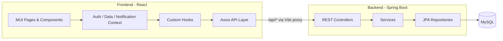

# Study Manager

**Study Manager** is a full-stack learning time tracking platform. Students set learning goals, plan study sessions, run a live timer, log offline study time, and review progress. Administrators manage users, roles, goals, settings, login history, and pending admin registrations.

This repository is the **React frontend** (`StudyManagerFrontend`). The REST API lives in the sibling [`StudyManagerBackend`](../StudyManagerBackend) / [`backend`](../backend) directory.

> Other languages: [Türkçe](README_TR.md) · [Deutsch](README_DE.md)  
> Architecture diagrams: [`architecture-uml.md`](architecture-uml.md)

---

## Table of Contents

- [Features](#features)
- [Tech Stack](#tech-stack)
- [Architecture](#architecture)
- [Prerequisites](#prerequisites)
- [Getting Started](#getting-started)
- [Configuration](#configuration)
- [Default Accounts](#default-accounts)
- [Available Scripts](#available-scripts)
- [Application Routes](#application-routes)
- [Project Structure](#project-structure)
- [API Documentation](#api-documentation)
- [Authentication](#authentication)
- [Troubleshooting](#troubleshooting)
- [License](#license)

---

## Features

### Student Application

| Module | Description |
|--------|-------------|
| **Dashboard** | Goals overview, recent sessions, upcoming plans, and smart reminders |
| **Goals** | 6-month learning goals with target hours, status, and up to 5 interim milestones per goal |
| **6-Month Plan** | Long-term calendar (study + plans + milestones), goal filter, and plan list shared with Planning |
| **Monthly Plan** | Month calendar with planned sessions, study activity, and dated milestones |
| **Planning** | Create, edit, complete, and delete planned study sessions (same data as 6-Month / Monthly views) |
| **Study Timer** | Live timer with heartbeat recovery; can start from a plan |
| **Study History** | View, edit, delete, and manually add offline study time |
| **Progress** | Charts plus summary cards (study time, goals, **Milestones** totals, weekly/monthly stats) |
| **Notifications** | In-app reminders for plans, goals, and inactivity; optional browser notifications |
| **Login Gap Alert** | Snackbar when returning after a longer absence |

#### Progress — Milestones card

On `/progress`, the **Milestones** summary card shows counts for **active goals**:

| Metric | Meaning |
|--------|---------|
| Total milestones | All interim goals linked to active goals |
| Completed milestones | Marked complete |
| Incomplete milestones | Still open |

#### Planning data flow

Plans created on **Planning** (`/planning`) are stored via `/api/plan-sessions` and appear on:

- **6-Month Plan** (calendar + Plans tab)
- **Monthly Plan** (calendar day cells)

Milestones with a due date appear as an orange trophy marker on calendar days (Monthly and 6-Month Plan).

### Admin Panel

| Module | Description |
|--------|-------------|
| **Dashboard** | Platform statistics: users, roles, goals, status breakdown |
| **Users** | List, filter, activate/deactivate, assign roles, delete users |
| **Roles** | Create and delete roles (system roles are protected) |
| **User Goals** | Admin view of all user goals with search and pagination |
| **Settings** | App settings (e.g. max session hours) |
| **Login History** | View, edit, and delete user login timestamps |
| **Admin Approvals** | Approve or reject administrator registration requests |

### Authentication & Registration

- JWT access token + refresh token
- Student registration with immediate access
- Admin candidate registration with approval workflow (`PENDING` → `APPROVED` / `REJECTED`)
- Role-based routing: admins → `/admin`, students → `/`
- Automatic token refresh via Axios interceptor (`/api/auth/refresh`)

---

## Tech Stack

### Frontend (this repo)

| Layer | Technology |
|-------|------------|
| Framework | React 19 |
| Build tool | Vite 8 |
| UI | Material UI (MUI) 9 |
| Routing | React Router 7 |
| HTTP client | Axios |
| Charts | Recharts |
| Date handling | Day.js |

### Backend (sibling repo)

| Layer | Technology |
|-------|------------|
| Runtime | Java 21 |
| Framework | Spring Boot 4.1 |
| Security | Spring Security + JWT |
| Persistence | Spring Data JPA / Hibernate |
| Database | MySQL 8 |
| API docs | springdoc-openapi (Swagger UI) |
| Build | Maven |

---

## Architecture



During development, Vite proxies `/api` requests to `http://127.0.0.1:8080`, avoiding CORS issues on the client.

Detailed UML (component, sequence, class-style, deployment): see [`architecture-uml.md`](architecture-uml.md).

---

## Prerequisites

| Requirement | Version |
|-------------|---------|
| **Node.js** | 18+ recommended |
| **npm** | 9+ |
| **Java JDK** | 21 |
| **MySQL** | 8.x |
| **Maven** | 3.x (or use the backend `mvnw` wrapper) |

---

## Getting Started

### 1. Create the database

```sql
CREATE DATABASE study_manager_db
  CHARACTER SET utf8mb4
  COLLATE utf8mb4_unicode_ci;
```

### 2. Configure the backend

Edit the backend `src/main/resources/application.properties`:

```properties
spring.datasource.url=jdbc:mysql://localhost:3306/study_manager_db?zeroDateTimeBehavior=CONVERT_TO_NULL&serverTimezone=Europe/Berlin
spring.datasource.username=root
spring.datasource.password=YOUR_PASSWORD

jwt.secret=YOUR_LONG_SECURE_SECRET_KEY
jwt.expiration=86400000
```

> **Note:** Never commit real credentials or production secrets to version control.

### 3. Start the backend

```bash
cd ../StudyManagerBackend   # or ../backend — depending on your folder name
./mvnw spring-boot:run      # Linux / macOS
.\mvnw.cmd spring-boot:run  # Windows
```

API base URL:

```
http://localhost:8080
```

On first startup, `DataInitializer` seeds default roles and test users if they do not already exist.

### 4. Install frontend dependencies

From this repository root (`StudyManagerFrontend`):

```bash
npm install
```

### 5. Start the frontend

```bash
npm run dev
```

Open:

```
http://localhost:5173
```

---

## Configuration

### Frontend proxy

`vite.config.js`:

```js
server: {
  proxy: {
    '/api': {
      target: 'http://127.0.0.1:8080',
      changeOrigin: true,
    },
  },
},
```

No `.env` file is required for local development when both services use the default ports.

### Auth storage

The logged-in user and tokens are stored in `localStorage` under `lm_auth_user`.

---

## Default Accounts

Created automatically on backend startup if missing:

| Role | Email | Password |
|------|-------|----------|
| Admin | `admin@example.com` | `admin` |
| Admin | `erkan@erkan.com` | `12345` |
| Student | `student1@example.com` | `student1` |

Admins redirect to `/admin` after login. Students redirect to `/`.

---

## Available Scripts

From this repository:

| Command | Description |
|---------|-------------|
| `npm run dev` | Vite dev server on port **5173** |
| `npm run build` | Production build to `dist/` |
| `npm run preview` | Preview the production build |
| `npm run lint` | Run ESLint |

From the backend repository:

| Command | Description |
|---------|-------------|
| `./mvnw spring-boot:run` | Run the API server |
| `./mvnw compile` | Compile without tests |
| `./mvnw test` | Run tests |

---

## Application Routes

### Public

| Path | Page |
|------|------|
| `/login` | Sign in |
| `/register` | Create account (student or admin candidate) |

### Student (authenticated)

| Path | Page |
|------|------|
| `/` | Dashboard |
| `/goals` | Goals |
| `/six-month-plan` | 6-Month Plan |
| `/monthly-plan` | Monthly Plan |
| `/planning` | Planning |
| `/timer` | Study Timer |
| `/study-history` | Study History |
| `/progress` | Progress |

### Admin (`ADMIN` role)

| Path | Page |
|------|------|
| `/admin` | Admin Dashboard |
| `/admin/users` | User Management |
| `/admin/roles` | Role Management |
| `/admin/goals` | User Goals |
| `/admin/settings` | Settings |
| `/admin/login-history` | Login History |
| `/admin/approvals` | Admin Approvals |

---

## Project Structure

```
EducationPlatform/
├── StudyManagerBackend/              # Spring Boot REST API (sibling)
│   └── src/main/java/.../
│       ├── config/
│       ├── controller/
│       ├── dto/
│       ├── entity/
│       ├── repository/
│       └── service/
│
└── StudyManagerFrontend/             # React SPA (this repo)
    ├── public/
    │   └── study-manager-logo.png
    ├── README.md                     # English (this file)
    ├── README_TR.md                  # Turkish
    ├── README_DE.md                  # German
    ├── architecture-uml.md           # UML diagrams
    └── src/
        ├── api/                      # Axios API modules
        ├── components/               # Shared UI (layout, calendar, dialogs)
        ├── context/                  # Auth, Data, Notification state
        ├── hooks/                    # Sessions, plans, milestones
        ├── pages/                    # Student + admin pages
        │   └── admin/
        ├── utils/                    # Dates, calendar, goals, plans, roles
        ├── App.jsx
        └── main.jsx
```

---

## API Documentation

Swagger UI (backend must be running):

```
http://localhost:8080/swagger-ui/index.html
```

OpenAPI JSON:

```
http://localhost:8080/v3/api-docs
```

Main API groups:

| Prefix | Description |
|--------|-------------|
| `/api/auth` | Login, register, refresh, logout |
| `/api/sessions` | Study sessions (timer, manual, CRUD) |
| `/api/goals` | Goals and goal-linked interim milestones |
| `/api/milestones` | Dated milestones (Monthly / 6-Month Plan) |
| `/api/plan-sessions` | Planned study sessions |
| `/api/settings` | Public app settings (e.g. max session hours) |
| `/api/admin/users` | User management |
| `/api/admin/roles` | Role management |
| `/api/admin/goals` | Admin goal overview |
| `/api/admin/settings` | Admin settings |
| `/api/admin/login-history` | Login history |
| `/api/admin/approvals` | Admin registration approvals |

---

## Authentication

### Login

```http
POST /api/auth/login
Content-Type: application/json

{
  "email": "student1@example.com",
  "password": "student1"
}
```

### Protected requests

```http
Authorization: Bearer <access-token>
```

In Swagger UI: **Authorize** → `Bearer <your-token>`.

Expired access tokens are refreshed automatically via `/api/auth/refresh` when a refresh token is present.

---

## Troubleshooting

| Issue | Likely cause | Solution |
|-------|--------------|----------|
| API network errors | Backend not running | Start backend on port **8080** |
| `401 Unauthorized` | Missing/expired JWT | Log in again |
| Blank page after login | Role redirect | Admins → `/admin`, students → `/` |
| Plans missing on 6-Month Plan | Wrong month or goal filter | Check month chips / “All goals” filter |
| Milestone not on calendar | No due date or wrong month | Set due date; open that month |
| CORS in production | Proxy missing | Configure reverse proxy or backend CORS |
| Study time not saving | Invalid duration / auth | Duration ≥ 1 minute; user logged in |

---

## License

Developed for educational purposes. Add a license file if you distribute or open-source the project.

---

## Related Documentation

- Frontend (Turkish): [`README_TR.md`](README_TR.md)
- Frontend (German): [`README_DE.md`](README_DE.md)
- Architecture UML: [`architecture-uml.md`](architecture-uml.md)
- Backend README (if present in sibling repo)
