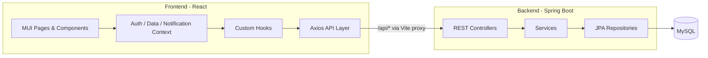

# Study Manager

**Study Manager**, öğrenme sürelerini takip etmek için geliştirilmiş bir full-stack platformdur. Öğrenciler öğrenme hedefleri belirler, çalışma oturumları planlar, canlı zamanlayıcı kullanır, çevrimdışı çalışma süresini kaydeder ve ilerlemeyi inceler. Yöneticiler kullanıcıları, rolleri, hedefleri, ayarları, giriş geçmişini ve bekleyen admin kayıtlarını yönetir.

Bu depo **React frontend** uygulamasıdır (`StudyManagerFrontend`). REST API kardeş dizinde yer alır: [`StudyManagerBackend`](../StudyManagerBackend) / [`backend`](../backend).

> Diğer diller: [English](README.md) · [Deutsch](README_DE.md)  
> Mimari diyagramlar: [`architecture-uml.md`](architecture-uml.md)

---

## İçindekiler

- [Özellikler](#özellikler)
- [Teknoloji Yığını](#teknoloji-yığını)
- [Mimari](#mimari)
- [Ön Koşullar](#ön-koşullar)
- [Başlangıç](#başlangıç)
- [Yapılandırma](#yapılandırma)
- [Varsayılan Hesaplar](#varsayılan-hesaplar)
- [Kullanılabilir Komutlar](#kullanılabilir-komutlar)
- [Uygulama Rotaları](#uygulama-rotaları)
- [Proje Yapısı](#proje-yapısı)
- [API Dokümantasyonu](#api-dokümantasyonu)
- [Kimlik Doğrulama](#kimlik-doğrulama)
- [Sorun Giderme](#sorun-giderme)
- [Lisans](#lisans)

---

## Özellikler

### Öğrenci Uygulaması

| Modül | Açıklama |
|-------|----------|
| **Dashboard** | Hedefler, son oturumlar, yaklaşan planlar ve akıllı hatırlatıcılar |
| **Goals (Hedefler)** | 6 aylık öğrenme hedefleri; hedef saat, durum ve hedef başına en fazla 5 ara mileston |
| **6-Month Plan** | Uzun vadeli takvim (çalışma + planlar + milestonlar), hedef filtresi ve Planning ile ortak plan listesi |
| **Monthly Plan** | Aylık takvim: planlı oturumlar, çalışma aktivitesi ve tarihli milestonlar |
| **Planning** | Planlı çalışma oturumlarını oluşturma, düzenleme, tamamlama ve silme |
| **Study Timer** | Heartbeat kurtarmalı canlı zamanlayıcı; bir plandan da başlatılabilir |
| **Study History** | Çalışma süresini görüntüleme, düzenleme, silme ve manuel ekleme |
| **Progress** | Grafikler ve özet kartlar (çalışma süresi, hedefler, **Milestones**, haftalık/aylık istatistikler) |
| **Notifications** | Plan, hedef ve hareketsizlik için uygulama içi hatırlatmalar; isteğe bağlı tarayıcı bildirimleri |
| **Login Gap Alert** | Uzun aradan sonra dönüşte snackbar uyarısı |

#### Progress — Milestones kartı

`/progress` sayfasındaki **Milestones** özet kartı, **aktif hedefler** için sayıları gösterir:

| Metrik | Anlamı |
|--------|--------|
| Total milestones | Aktif hedeflere bağlı tüm ara hedefler |
| Completed milestones | Tamamlanmış olanlar |
| Incomplete milestones | Hâlâ açık olanlar |

#### Planlama veri akışı

**Planning** (`/planning`) üzerinde oluşturulan planlar `/api/plan-sessions` ile kaydedilir ve şuralarda görünür:

- **6-Month Plan** (takvim + Plans sekmesi)
- **Monthly Plan** (takvim gün hücreleri)

Bitiş tarihi olan milestonlar, takvim günlerinde turuncu kupa işaretçisi olarak görünür (Monthly ve 6-Month Plan).

### Admin Paneli

| Modül | Açıklama |
|-------|----------|
| **Dashboard** | Platform istatistikleri: kullanıcılar, roller, hedefler, durum dağılımı |
| **Users** | Listeleme, filtreleme, etkinleştirme/devre dışı bırakma, rol atama, silme |
| **Roles** | Rol oluşturma ve silme (sistem rolleri korumalıdır) |
| **User Goals** | Tüm kullanıcı hedeflerinin arama ve sayfalama ile admin görünümü |
| **Settings** | Uygulama ayarları (ör. maksimum oturum saati) |
| **Login History** | Kullanıcı giriş zaman damgalarını görüntüleme, düzenleme ve silme |
| **Admin Approvals** | Yönetici kayıt taleplerini onaylama veya reddetme |

### Kimlik Doğrulama ve Kayıt

- JWT erişim tokenı + yenileme tokenı
- Öğrenci kaydı ile anında erişim
- Admin adayı kaydı ve onay iş akışı (`PENDING` → `APPROVED` / `REJECTED`)
- Rol tabanlı yönlendirme: adminler → `/admin`, öğrenciler → `/`
- Axios interceptor ile otomatik token yenileme (`/api/auth/refresh`)

---

## Teknoloji Yığını

### Frontend (bu depo)

| Katman | Teknoloji |
|--------|-----------|
| Framework | React 19 |
| Derleme aracı | Vite 8 |
| UI | Material UI (MUI) 9 |
| Yönlendirme | React Router 7 |
| HTTP istemcisi | Axios |
| Grafikler | Recharts |
| Tarih işlemleri | Day.js |

### Backend (kardeş depo)

| Katman | Teknoloji |
|--------|-----------|
| Çalışma zamanı | Java 21 |
| Framework | Spring Boot 4.1 |
| Güvenlik | Spring Security + JWT |
| Kalıcılık | Spring Data JPA / Hibernate |
| Veritabanı | MySQL 8 |
| API dokümantasyonu | springdoc-openapi (Swagger UI) |
| Derleme | Maven |

---

## Mimari



Geliştirme sırasında Vite, `/api` isteklerini `http://127.0.0.1:8080` adresine yönlendirerek istemci tarafında CORS sorunlarını önler.

Ayrıntılı UML (bileşen, sıra, sınıf tarzı, dağıtım): [`architecture-uml.md`](architecture-uml.md).

---

## Ön Koşullar

| Gereksinim | Sürüm |
|------------|-------|
| **Node.js** | 18+ önerilir |
| **npm** | 9+ |
| **Java JDK** | 21 |
| **MySQL** | 8.x |
| **Maven** | 3.x (veya backend `mvnw` sarmalayıcısı) |

---

## Başlangıç

### 1. Veritabanını oluşturun

```sql
CREATE DATABASE study_manager_db
  CHARACTER SET utf8mb4
  COLLATE utf8mb4_unicode_ci;
```

### 2. Backend'i yapılandırın

Backend `src/main/resources/application.properties` dosyasını düzenleyin:

```properties
spring.datasource.url=jdbc:mysql://localhost:3306/study_manager_db?zeroDateTimeBehavior=CONVERT_TO_NULL&serverTimezone=Europe/Berlin
spring.datasource.username=root
spring.datasource.password=SIFRENIZ

jwt.secret=UZUN_GUVENLI_GIZLI_ANAHTARINIZ
jwt.expiration=86400000
```

> **Not:** Gerçek kimlik bilgilerini veya üretim sırlarını sürüm kontrolüne commit etmeyin.

### 3. Backend'i başlatın

```bash
cd ../StudyManagerBackend   # veya ../backend — klasör adına göre
./mvnw spring-boot:run      # Linux / macOS
.\mvnw.cmd spring-boot:run  # Windows
```

API taban URL'si:

```
http://localhost:8080
```

İlk başlangıçta `DataInitializer`, yoksa varsayılan rolleri ve test kullanıcılarını oluşturur.

### 4. Frontend bağımlılıklarını yükleyin

Bu depo kökünden (`StudyManagerFrontend`):

```bash
npm install
```

### 5. Frontend'i başlatın

```bash
npm run dev
```

Tarayıcıda açın:

```
http://localhost:5173
```

---

## Yapılandırma

### Frontend proxy

`vite.config.js`:

```js
server: {
  proxy: {
    '/api': {
      target: 'http://127.0.0.1:8080',
      changeOrigin: true,
    },
  },
},
```

Her iki servis varsayılan portlarda çalışıyorsa yerel geliştirme için `.env` dosyası gerekmez.

### Auth depolama

Oturum açmış kullanıcı ve tokenlar `localStorage` içinde `lm_auth_user` anahtarı altında saklanır.

---

## Varsayılan Hesaplar

Backend başlangıcında yoksa otomatik oluşturulur:

| Rol | E-posta | Şifre |
|-----|---------|-------|
| Admin | `admin@example.com` | `admin` |
| Admin | `erkan@erkan.com` | `12345` |
| Öğrenci | `student1@example.com` | `student1` |

Adminler girişten sonra `/admin` adresine, öğrenciler `/` adresine yönlendirilir.

---

## Kullanılabilir Komutlar

Bu depodan:

| Komut | Açıklama |
|-------|----------|
| `npm run dev` | Port **5173** üzerinde Vite geliştirme sunucusu |
| `npm run build` | Üretim derlemesi → `dist/` |
| `npm run preview` | Üretim derlemesini önizleme |
| `npm run lint` | ESLint çalıştır |

Backend deposundan:

| Komut | Açıklama |
|-------|----------|
| `./mvnw spring-boot:run` | API sunucusunu çalıştır |
| `./mvnw compile` | Testler olmadan derle |
| `./mvnw test` | Testleri çalıştır |

---

## Uygulama Rotaları

### Genel

| Yol | Sayfa |
|-----|-------|
| `/login` | Giriş |
| `/register` | Hesap oluştur (öğrenci veya admin adayı) |

### Öğrenci (kimliği doğrulanmış)

| Yol | Sayfa |
|-----|-------|
| `/` | Dashboard |
| `/goals` | Hedefler |
| `/six-month-plan` | 6 Aylık Plan |
| `/monthly-plan` | Aylık Plan |
| `/planning` | Planlama |
| `/timer` | Çalışma Zamanlayıcısı |
| `/study-history` | Çalışma Geçmişi |
| `/progress` | İlerleme |

### Admin (`ADMIN` rolü)

| Yol | Sayfa |
|-----|-------|
| `/admin` | Admin Dashboard |
| `/admin/users` | Kullanıcı Yönetimi |
| `/admin/roles` | Rol Yönetimi |
| `/admin/goals` | Kullanıcı Hedefleri |
| `/admin/settings` | Ayarlar |
| `/admin/login-history` | Giriş Geçmişi |
| `/admin/approvals` | Admin Onayları |

---

## Proje Yapısı

```
EducationPlatform/
├── StudyManagerBackend/              # Spring Boot REST API (kardeş)
│   └── src/main/java/.../
│       ├── config/
│       ├── controller/
│       ├── dto/
│       ├── entity/
│       ├── repository/
│       └── service/
│
└── StudyManagerFrontend/             # React SPA (bu depo)
    ├── public/
    │   └── study-manager-logo.png
    ├── README.md                     # İngilizce
    ├── README_TR.md                  # Türkçe (bu dosya)
    ├── README_DE.md                  # Almanca
    ├── architecture-uml.md           # UML diyagramları
    └── src/
        ├── api/                      # Axios API modülleri
        ├── components/               # Ortak UI (layout, takvim, diyaloglar)
        ├── context/                  # Auth, Data, Notification durumu
        ├── hooks/                    # Oturumlar, planlar, milestonlar
        ├── pages/                    # Öğrenci + admin sayfaları
        │   └── admin/
        ├── utils/                    # Tarih, takvim, hedef, plan, rol yardımcıları
        ├── App.jsx
        └── main.jsx
```

---

## API Dokümantasyonu

Swagger UI (backend çalışıyor olmalı):

```
http://localhost:8080/swagger-ui/index.html
```

OpenAPI JSON:

```
http://localhost:8080/v3/api-docs
```

Ana API grupları:

| Önek | Açıklama |
|------|----------|
| `/api/auth` | Giriş, kayıt, yenileme, çıkış |
| `/api/sessions` | Çalışma oturumları (zamanlayıcı, manuel, CRUD) |
| `/api/goals` | Hedefler ve hedefe bağlı ara milestonlar |
| `/api/milestones` | Tarihli milestonlar (Monthly / 6-Month Plan) |
| `/api/plan-sessions` | Planlı çalışma oturumları |
| `/api/settings` | Genel uygulama ayarları (ör. maks. oturum saati) |
| `/api/admin/users` | Kullanıcı yönetimi |
| `/api/admin/roles` | Rol yönetimi |
| `/api/admin/goals` | Admin hedef özeti |
| `/api/admin/settings` | Admin ayarları |
| `/api/admin/login-history` | Giriş geçmişi |
| `/api/admin/approvals` | Admin kayıt onayları |

---

## Kimlik Doğrulama

### Giriş

```http
POST /api/auth/login
Content-Type: application/json

{
  "email": "student1@example.com",
  "password": "student1"
}
```

### Korumalı istekler

```http
Authorization: Bearer <access-token>
```

Swagger UI'da: **Authorize** → `Bearer <tokeniniz>`.

Süresi dolmuş erişim tokenları, yenileme tokenı varsa `/api/auth/refresh` üzerinden otomatik yenilenir.

---

## Sorun Giderme

| Sorun | Olası neden | Çözüm |
|-------|-------------|-------|
| API ağ hataları | Backend çalışmıyor | Backend'i port **8080** üzerinde başlatın |
| `401 Unauthorized` | Eksik/süresi dolmuş JWT | Yeniden giriş yapın |
| Girişten sonra boş sayfa | Rol yönlendirmesi | Adminler → `/admin`, öğrenciler → `/` |
| 6-Month Plan'da plan yok | Yanlış ay veya hedef filtresi | Ay chip'lerini / “All goals” filtresini kontrol edin |
| Takvimde mileston yok | Bitiş tarihi yok veya yanlış ay | Due date ayarlayın; ilgili ayı açın |
| Üretimde CORS | Proxy yok | Reverse proxy veya backend CORS yapılandırın |
| Çalışma süresi kaydedilmiyor | Geçersiz süre / auth | Süre ≥ 1 dakika; kullanıcı giriş yapmış olmalı |

---

## Lisans

Eğitim amaçlı geliştirilmiştir. Dağıtır veya açık kaynak yaparsanız bir lisans dosyası ekleyin.

---

## İlgili Dokümantasyon

- Frontend (İngilizce): [`README.md`](README.md)
- Frontend (Almanca): [`README_DE.md`](README_DE.md)
- Mimari UML: [`architecture-uml.md`](architecture-uml.md)
- Backend README (kardeş depoda varsa)
