# Study Manager — Architecture UML

Architecture diagrams for the **Study Manager** frontend (`StudyManagerFrontend`) and its integration with the Spring Boot backend.

Related docs: [README (EN)](README.md) · [README (TR)](README_TR.md) · [README (DE)](README_DE.md)

Diagrams use [Mermaid](https://mermaid.js.org/) (renders on GitHub / many Markdown viewers). PlantUML-style equivalents are noted where helpful.

---

## Table of Contents

1. [System Context](#1-system-context)
2. [Component Diagram](#2-component-diagram)
3. [Frontend Layer Structure](#3-frontend-layer-structure)
4. [Routing & Access Control](#4-routing--access-control)
5. [Sequence: Login](#5-sequence-login)
6. [Sequence: Token Refresh](#6-sequence-token-refresh)
7. [Sequence: Study Timer Session](#7-sequence-study-timer-session)
8. [Sequence: Plan → Calendar](#8-sequence-plan--calendar)
9. [Domain Model (Frontend View)](#9-domain-model-frontend-view)
10. [Deployment](#10-deployment)
11. [API Module Map](#11-api-module-map)

---

## 1. System Context

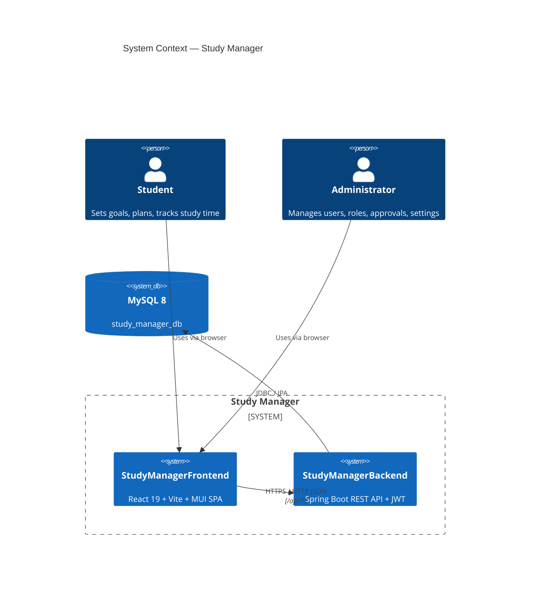

If C4 rendering is unavailable, use this equivalent:

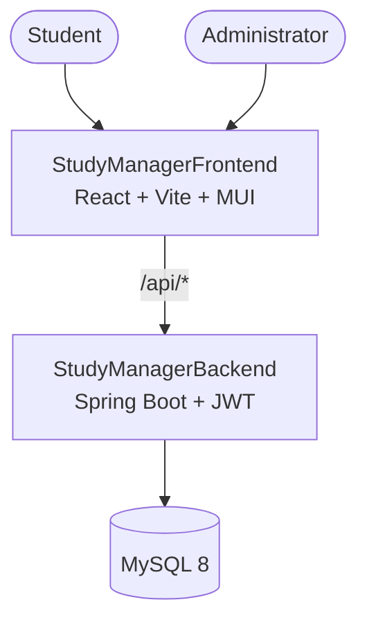

---

## 2. Component Diagram

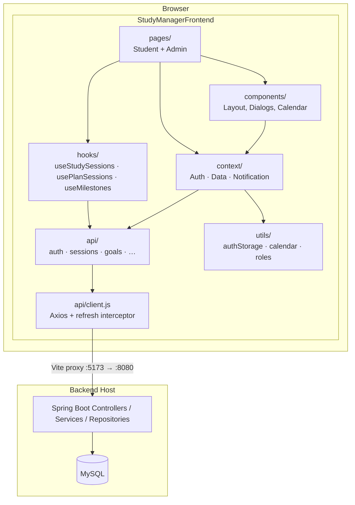

### PlantUML equivalent (optional)

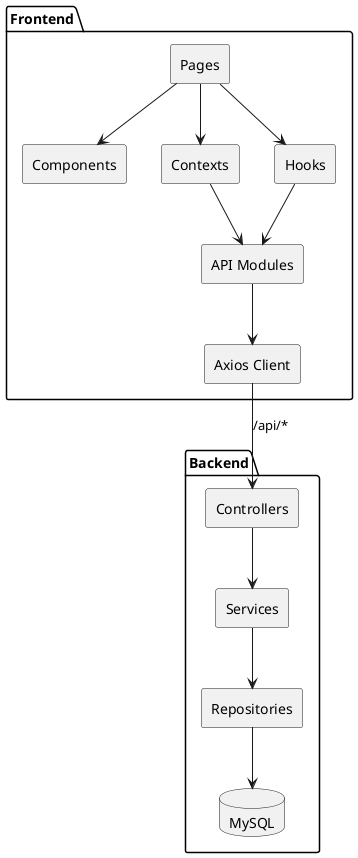

---

## 3. Frontend Layer Structure

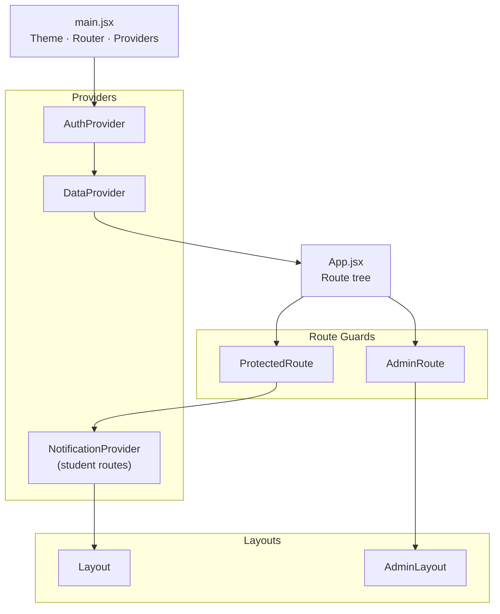

Provider order (outer → inner): `BrowserRouter` → `ThemeProvider` → `AuthProvider` → `DataProvider` → `App`.

---

## 4. Routing & Access Control

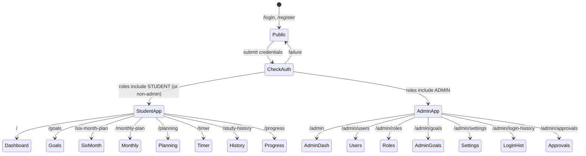

| Guard | File | Behavior |
|-------|------|----------|
| `ProtectedRoute` | `components/ProtectedRoute.jsx` | Requires authenticated user; non-admins use student shell |
| `AdminRoute` | `components/AdminRoute.jsx` | Requires `ADMIN` role |

---

## 5. Sequence: Login

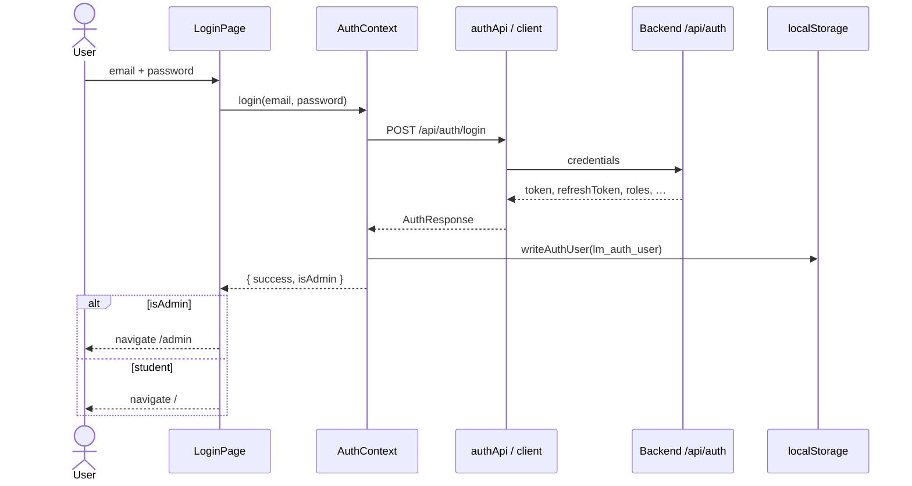

---

## 6. Sequence: Token Refresh

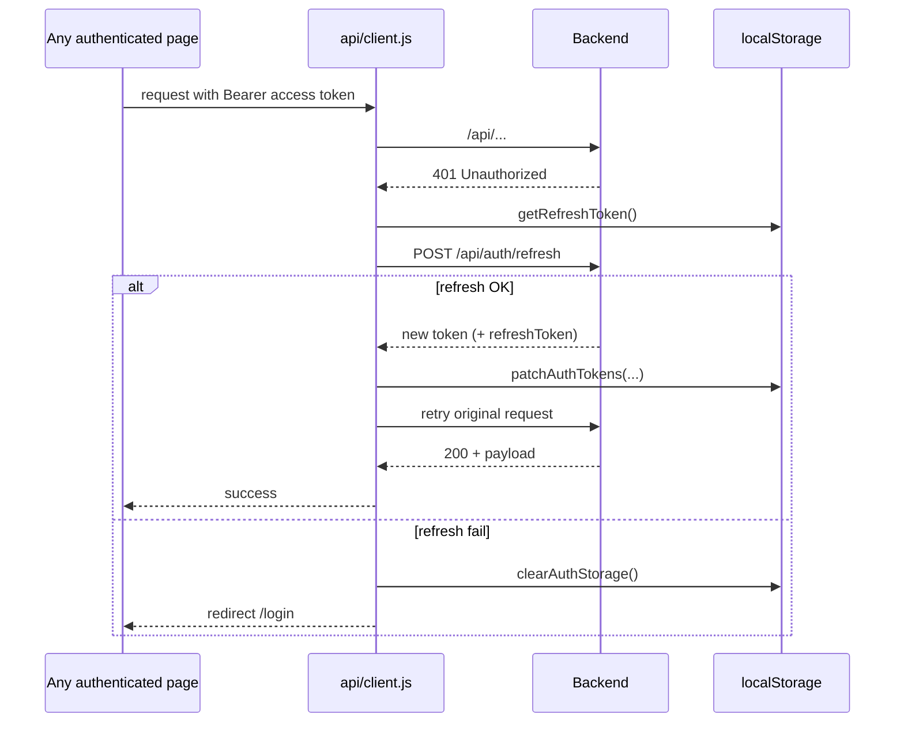

---

## 7. Sequence: Study Timer Session

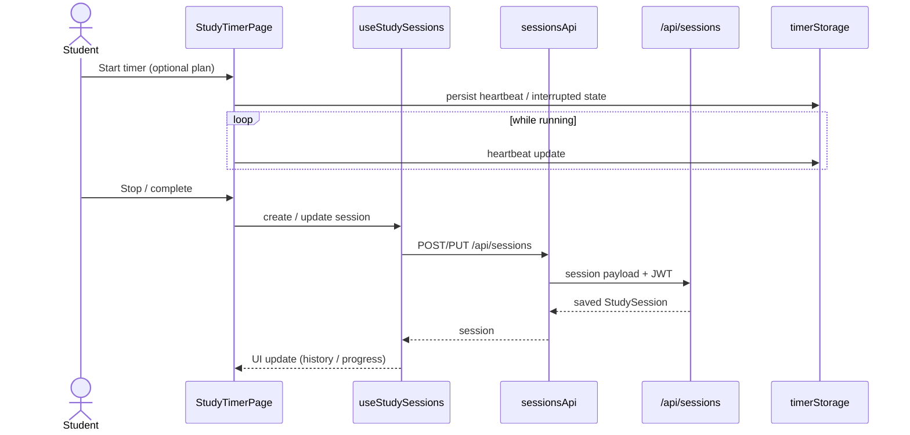

Interrupted sessions can be recovered via `InterruptedSessionDialog` using data from `timerStorage`.

---

## 8. Sequence: Plan → Calendar

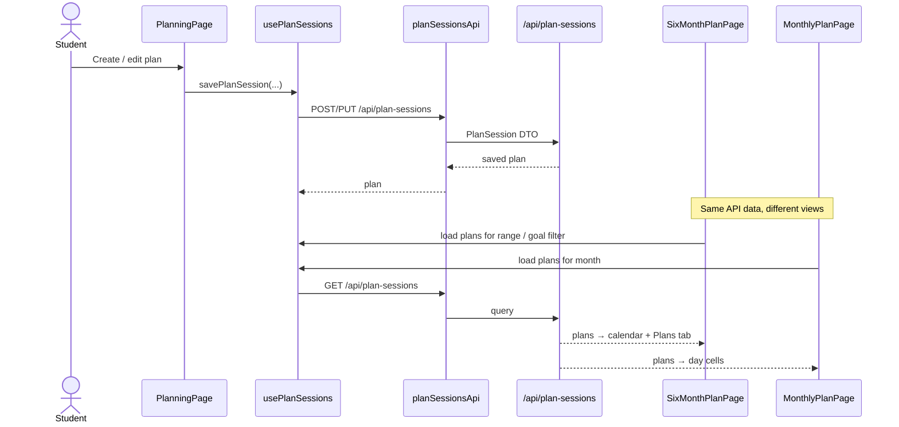

Milestones with due dates are loaded via `milestonesApi` / `useMilestones` and rendered as trophy markers on both calendars.

---

## 9. Domain Model (Frontend View)

Conceptual entities as consumed by the SPA (IDs and fields may mirror backend DTOs):

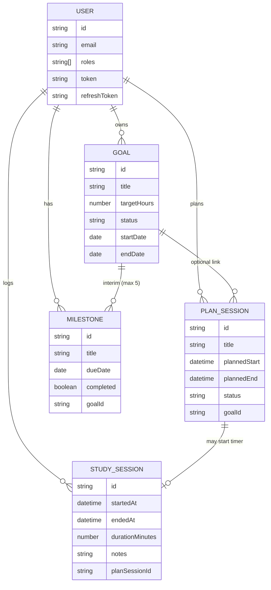

---

## 10. Deployment

### Local development

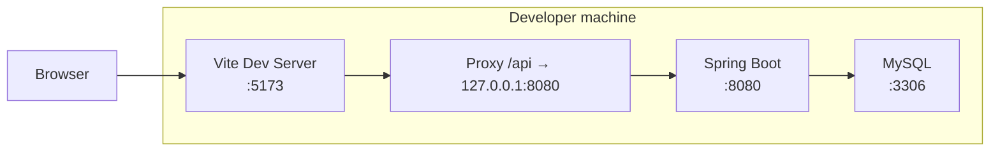

### Production (typical)

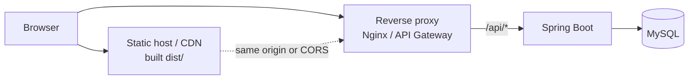

Build artifact: `npm run build` → `dist/`.

---

## 11. API Module Map

| Frontend module | Primary backend prefix | Used by |
|-----------------|------------------------|---------|
| `api/authApi.js` | `/api/auth` | AuthContext, login/register |
| `api/sessionsApi.js` | `/api/sessions` | Timer, Study History, Progress |
| `api/goalsApi.js` | `/api/goals` | Goals, Dashboard, Progress |
| `api/milestonesApi.js` | `/api/milestones` | Monthly / 6-Month calendars |
| `api/planSessionsApi.js` | `/api/plan-sessions` | Planning, calendars |
| `api/settingsApi.js` | `/api/settings` | Timer limits, public settings |
| `api/adminApi.js` | `/api/admin/*` | Admin pages |

Shared HTTP behavior lives in `api/client.js` (base URL `''`, Bearer auth, 401 → refresh → retry).

---

## Legend

| Symbol | Meaning |
|--------|---------|
| Context | Global React state / providers |
| Hook | Data-fetching / mutation helpers |
| Guard | Route-level authorization |
| Proxy | Dev-only Vite forward of `/api` |

For OpenAPI details, run the backend and open:

- Swagger UI: `http://localhost:8080/swagger-ui/index.html`
- OpenAPI JSON: `http://localhost:8080/v3/api-docs`
